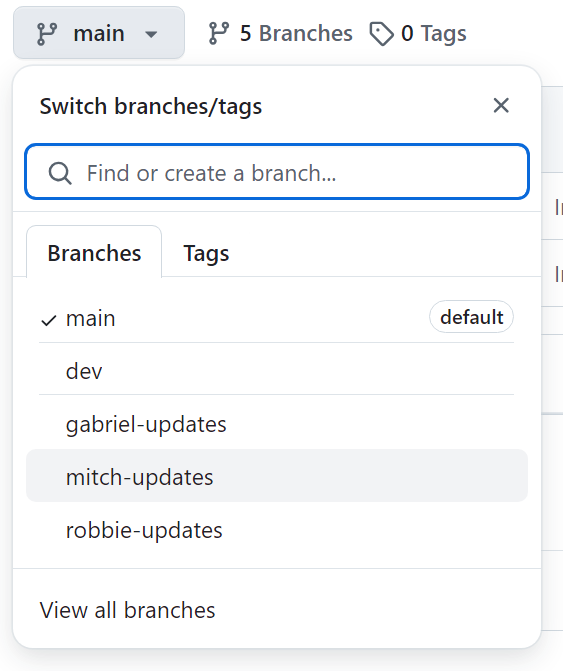

# plant-app

## Description

This web application allows users to take care of a virtual plant through a simple, interactive two-page interface. Users can water their plant and are provided with information on their selected plant via an API.

- [User Story](#userstory)
- [Installation](#installation)
- [Credits](#credits)
- [License](#license)

## User Story

AS a user I should be able to select a plant from the landing page
An API call is triggered, data is retrieved on the selected plant and stored in localStorage. This action redirects to the app page.

AS a user WHEN I get to the app page I see a header containing game style data
The selected plant is retrieved from localStorage

AS a user WHEN I get to the app page I see my selected plant and watering options
The selected plant is retrieved from localStorage

AS a user WHEN I am on the app I can water the plant
Logic retrieves data from local storage on selected plant, adds water level, saves new water level to local storage and presents a message to the user.

AS a user WHEN I am on the app page I am presented with information on my selected plant
Logic retrieves and displays information on the selected plant from local storage.

## Working with this repo

### Installation

1. Clone the repository to your local computer

   ```
   git clone <HTTPS URL>
   ```

2. Fetch all remote branches

   ```
   git fetch --all
   ```

3. List all branches (local and remote)

   ```
   git branch -a
   ```

4. Switch to a branch on your local computer and track a remote branch

   ```
   git checkout -b <branch-name> origin/<branch-name>
   ```

   example `git checkout -b mitch-updates origin/mitch-updates`

   WHERE origin/mitch-updates is the remote branch AND mitch-updates is the local branch

### Push Updates

1. Git add

1. Git commit

3. Push changes to the correct remote branch
   ```
   git push origin <branch-name>
   ```

    Example: On my local computer I use
    git push origin mitch-updates
    This will push changes to the remote mitch-updates branch

4. Select the target branch in Github
   

5. Create the pull request

6. In the dev branch create a pull request with updates from your `name-updates` branch

### Pull Updates

1. 


## Credits

## License

This project is licensed under the MIT License
